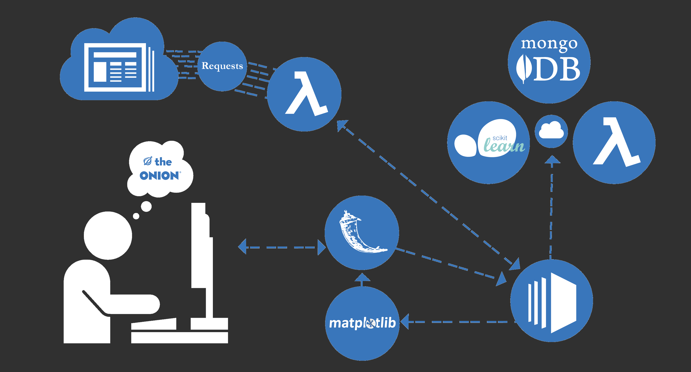

Fake News Detector
==============

In an era increasingly defined by the proliferation of misinformation and polarized politics, it's important for internet users to have context for what's on their screen. This microservice uses natural language processing to analyze patterns of bias on any news website in real time. Each time a url is submitted, dozens of the most recent articles are collected and analyzed for a variety of factors, from political bias to journalistic accuracy. 

# How it works

## Data Collection
--------

[OpenSources](http://www.opensources.co/) maintains a downloadable database of news sites with tags related to journalistic accuracy.

[Media Bias Fact Check](https://mediabiasfactcheck.com/)  maintains an online directory of news sites, categorized by the political bias and accuracy.

Using a customized fork of the excellent [Newspaper](https://github.com/codelucas/newspaper) library this project spiders these websites for new articles to and stores them by tag in MongoDB. Text is preprocessed with unicode cleaning, stemming using NLTK.
Every week ~45,000 articles are scraped from these sites.

Modeling
--------

Using labeled data of bias in news sites from open source projects, a TFIDF vector is fitted on a corpus of 45k scraped websites. Non-negative matrix factorization is applied the corpus of articles in each category to amplify the signature of the categories to produce 'category vectors'. 

Deployment
----------

With the help of labeled data from open source projects that have documented bias in thousands of news sources, this project aims to classify the bias on unseen sources. This project periodically collects tens of thousands of articles from these source and trains a neural network on the article text in order to model and characterize bias. When a user visits [areyoufakenews.com](http://areyoufakenews.com/) and submits a news website url for analysis, a system of EC2 instances and AWS Lambda functions spider the new site and gather few dozen of the latest articles. The collected text is sent to the custom-built neural network residing in a second AWS Lambda function for classification. The results are rendered in matplotlib and published via flask. This project is under continued development as UX, data visualization and modeling are expanded and refined.

